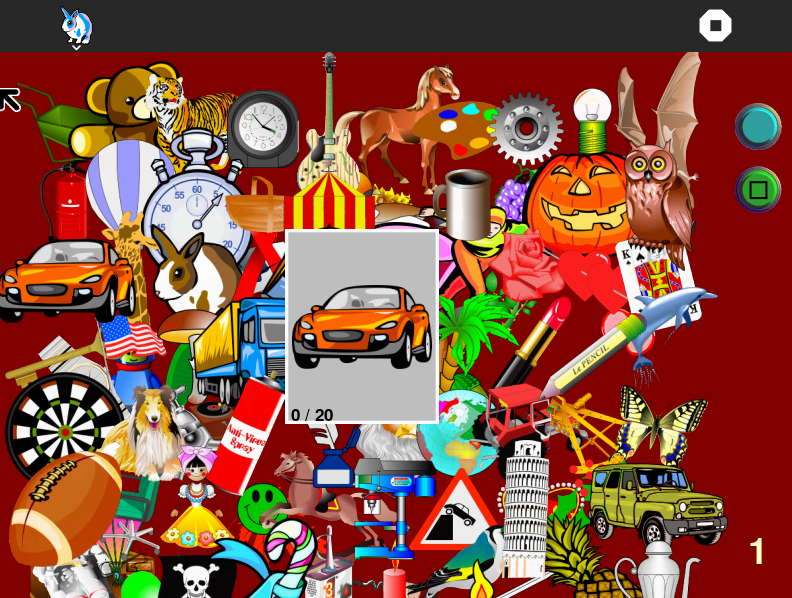

Jumble Activity 
===============

Jumble is a picture matching activity, where a child learns to identify the object in a picture card and picks it from the clutter of objects behind.

How to use?
===============
Jumble is not a part of Sugar Desktop but can be added. Refer to the following links-

* [How to Get Sugar on sugarlabs.org](https://sugarlabs.org/), 
* [How to use Sugar](https://help.sugarlabs.org/) 

Wait for the game to jumble all objects and display a card. Then identify the object displayed on the card and pick the same object from the clutter of objects behind. You can drag the card around to see the objects which are behind the card. Click on the Green button if you want to pass. Once all 20 items are identified, you will see a Thumbs up emoji display card. To keep playing, click on the blue button. The number of times you have finished identifying the set of 20 objects will be displayed on the bottom right of the screen.

How to upgrade?
===============
On Sugar Desktop systems;

* [Use My Settings,](https://help.sugarlabs.org/my_settings.html) [Software Update](https://help.sugarlabs.org/my_settings.html#software-update) 
* [Use Browse to open ](https://activities.sugarlabs.org/)activities.sugarlabs.org Search for Jumble, then download

